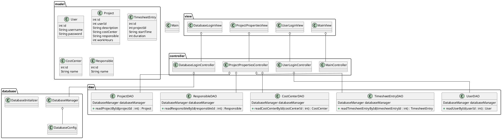

# Klassendiagramm

```plantuml
@startuml

skinparam linetype ortho

class Main {}

package dao {

    class UserDAO {
        DatabaseManager databaseManager
        + readUserById(userId : int) : User
    }
    
    class ProjectDAO {
        DatabaseManager databaseManager
        + readProjectById(projectId : int) : Project
    }
    
    class TimesheetEntryDAO {
        DatabaseManager databaseManager
        + readTimesheetEntryById(timesheetEntryId : int) : TimesheetEntry
    }
        
    class CostCenterDAO {
        DatabaseManager databaseManager
        + readCostCenterById(costCenterId : int) : CostCenter
    }
        
    class ResponsibleDAO {
        DatabaseManager databaseManager
        + readResponsibleById(responsibleId : int) : Responsible
    }
        
}

package model {

    class User {
        int id
        String username
        String password
    }
    
    class Project {
        int id
        int userId
        String description
        String costCenter
        String responsible
        int workHours
    }
   
    class TimesheetEntry {
        int id
        int projectId
        String startTime
        int duration
    }
    
    class CostCenter {
        int id
        String name
    }
    
    class Responsible {
        int id
        String name
    }
    
}

package view {

    class MainView {}
    class DatabaseLoginView {}
    class UserLoginView {}
    class ProjectPropertiesView {}

}

package controller {

    class MainController {}
    class DatabaseLoginController {}
    class UserLoginController {}
    class ProjectPropertiesController {}

}


package database { 

    class DatabaseConfig {}
    class DatabaseManager {}
    class DatabaseInitializer {}

}

DatabaseLoginView o-- DatabaseLoginController
UserLoginView o-- UserLoginController
ProjectPropertiesView o-- ProjectPropertiesController
MainView o-- MainController

UserLoginController o-- UserDAO
ProjectPropertiesController o-- ProjectDAO
ProjectPropertiesController o-- CostCenterDAO
ProjectPropertiesController o-- ResponsibleDAO
ProjectPropertiesController o-- TimesheetEntryDAO

DatabaseManager o-- DatabaseConfig
DatabaseLoginController o-- DatabaseManager 

@enduml

```
