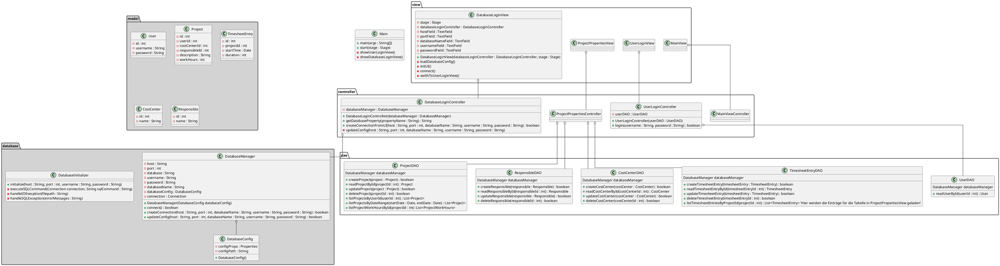

# Klassendiagramm

```plantuml
@startuml

skinparam linetype ortho

class Main {
    + main(args : String[])
    + start(stage : Stage)
    - showUserLoginView()
    - showDatabaseLoginView()    
}

package dao {

    class UserDAO {
        DatabaseManager databaseManager
        + readUserById(userId : int) : User
    }
    
    class ProjectDAO {
        DatabaseManager databaseManager
        + createProject(project : Project) : boolean
        + readProjectById(projectId : int) : Project
        + updateProject(project : Project) : boolean
        + deleteProject(projectId : int) : boolean
        + listProjectsByUserId(userId : int) : List<Project>
        + listProjectsByDateRange(startDate : Date, endDate : Date) : List<Project>
        + listProjectWorkHoursById(projectId : int) :List<ProjectWorkHours>
    }
    
    class TimesheetEntryDAO {
        DatabaseManager databaseManager
        + createTimesheetEntry(timesheetEntry : TimesheetEntry) : boolean
        + readTimesheetEntryById(timesheetEntryId : int) : TimesheetEntry
        + updateTimesheetEntry(timesheetEntry : TimesheetEntry) : boolean
        + deleteTimesheetEntry(timesheetEntryId : int) : boolean
        + listTimesheetEntriesByProjectId(projectId : int) : List<TimesheetEntry> 'Hier werden die Einträge für die Tabelle in ProjectPropertiesView geladen'
    }
        
    class CostCenterDAO {
        DatabaseManager databaseManager
        + createCostCenter(costCenter : CostCenter) : boolean
        + readCostCenterById(costCenterId : int) : CostCenter
        + updateCostCenter(costCenter : CostCenter) : boolean
        + deleteCostCenter(costCenterId : int) : boolean
        
    }
        
    class ResponsibleDAO {
        DatabaseManager databaseManager
        + createResponsible(responsible : Responsible) : boolean
        + readResponsibleById(responsibleId : int) : Responsible
        + updateResponsible(responsible : Responsible) : boolean
        + deleteResponsible(responsibleId : int) : boolean
    }
        
}

package model #lightgray {

    class User {
        - id : int
        - username : String
        - password : String
    }
    
    class Project {
        - id : int
        - userId : int
        - costCenterId : int
        - responsibleId : int
        - description : String
        - workHours : int       
    }
   
    class TimesheetEntry {
        - id : int
        - projectId : int
        - startTime : Date
        - duration : int
    }
    
    class CostCenter {
        - id : int
        - name : String
    }
    
    class Responsible {
        - id : int
        - name : String
    }
    
}

package view {

    class MainView {}
    class DatabaseLoginView {
        - stage : Stage
        - databaseLoginController : DatabaseLoginController
        - hostField : TextField
        - portField : TextField
        - databaseNameField : TextField
        - usernameField : TextField
        - passwordField : TextField
        
        + DatabaseLoginView(databaseLoginController : DatabaseLoginController, stage : Stage)
        - loadDatabaseConfig()
        - initUI()
        - connect()
        - swithToUserLoginView()
    }
    class UserLoginView {}
    class ProjectPropertiesView {}

}

package controller {

    class MainViewController {}
    class DatabaseLoginController {
        - databaseManager : DatabaseManager
        + DatabaseLoginController(databaseManager : DatabaseManager)
        + getDatabaseProperty(propertyName : String) : String
        + createConnectionFromUI(host : String, port : int, databaseName : String, username : String, password : String) : boolean
        - updateConfig(host : String, port : int, databaseName : String, username : String, password : String)
    }
    class UserLoginController {
        - userDAO : UserDAO
        + UserLoginController(userDAO : UserDAO)
        + login(username : String, password : String) : boolean
        }
    class ProjectPropertiesController {
        
    }

}


package database #Lightgray { 

    class DatabaseConfig {
        - configProps : Properties
        - configPath : String
        
        + DatabaseConfig()
    }
    class DatabaseManager {
        - host : String
        - port : int
        - database : String
        - username : String
        - password : String
        - databaseName : String
        - databaseConfig : DatabaseConfig
        - connection : Connection
        
        + DatabaseManager(DatabaseConfig databaseConfig)
        + connect() : boolean
        + createConnection(host : String, port : int, databaseName : String, username : String, password : String) : boolean
        + updateConfig(host : String, port : int, databaseName : String, username : String, password : String) : boolean
    }
    class DatabaseInitializer {
        + initialize(host : String, port : int, username : String, password : String)
        - executeSQLCommand(Connection connection, String sqlCommand : String)
        - handleIOExecption(filepath : String)
        - handleSQLException(errorMessages : String)
}

DatabaseLoginView o-- DatabaseLoginController
UserLoginView o-- UserLoginController
ProjectPropertiesView o-- ProjectPropertiesController
MainView o-- MainViewController

UserLoginController o-- UserDAO
ProjectPropertiesController o-- ProjectDAO
ProjectPropertiesController o-- CostCenterDAO
ProjectPropertiesController o-- ResponsibleDAO
ProjectPropertiesController o-- TimesheetEntryDAO

DatabaseManager o-- DatabaseConfig
DatabaseLoginController o-- DatabaseManager 

@enduml
```