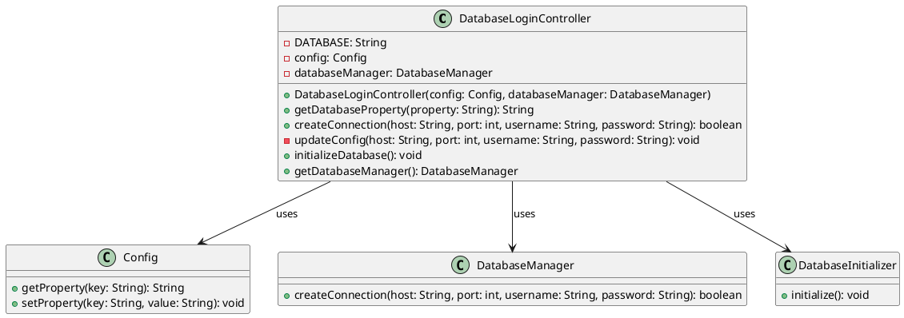

# Datdebank Klassendiagramm

```plantuml
@startuml

class DatabaseLoginController {
    -DATABASE: String
    -config: Config
    -databaseManager: DatabaseManager
    +DatabaseLoginController(config: Config, databaseManager: DatabaseManager)
    +getDatabaseProperty(property: String): String
    +createConnection(host: String, port: int, username: String, password: String): boolean
    -updateConfig(host: String, port: int, username: String, password: String): void
    +initializeDatabase(): void
    +getDatabaseManager(): DatabaseManager
}

class Config {
    +getProperty(key: String): String
    +setProperty(key: String, value: String): void
}

class DatabaseManager {
    +createConnection(host: String, port: int, username: String, password: String): boolean
}

class DatabaseInitializer {
    +initialize(): void
}

DatabaseLoginController --> Config: uses
DatabaseLoginController --> DatabaseManager: uses
DatabaseLoginController --> DatabaseInitializer: uses

@enduml
```
