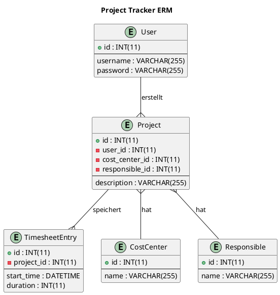

```plantuml
@startuml
title Project Tracker ERM

entity "User" as user {
  + id : INT(11) 
  --
  username : VARCHAR(255)
  password : VARCHAR(255)
}

entity "Project" as project {
  + id : INT(11)  
  - user_id : INT(11)  
  - cost_center_id : INT(11)
  - responsible_id : INT(11)
  --
  description : VARCHAR(255)
}

entity "TimesheetEntry" as timesheet {
  + id : INT(11)  
  - project_id : INT(11)  
  --
  start_time : DATETIME
  duration : INT(11)
}

entity "CostCenter" as costcenter {
  + id : INT(11)  
  --
  name : VARCHAR(255)
}

entity "Responsible" as responsible {
  + id : INT(11)  
  --
  name : VARCHAR(255)
}

user --{ project : erstellt
project --{ timesheet : speichert
project }-- costcenter : hat
project }-- responsible : hat

@enduml
```