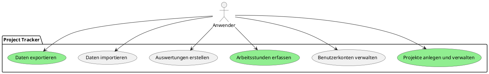

```plantuml
@startuml
actor Anwender

package "Project Tracker" {
usecase "Projekte anlegen und verwalten" #lightgreen
usecase "Benutzerkonten verwalten" 
usecase "Arbeitsstunden erfassen" #lightgreen
usecase "Auswertungen erstellen"
usecase "Daten importieren"
usecase "Daten exportieren" #lightgreen
}

Anwender --> "Projekte anlegen und verwalten"
Anwender --> "Benutzerkonten verwalten"
Anwender --> "Arbeitsstunden erfassen"
Anwender --> "Auswertungen erstellen"
Anwender --> "Daten importieren"
Anwender --> "Daten exportieren"

@enduml
```